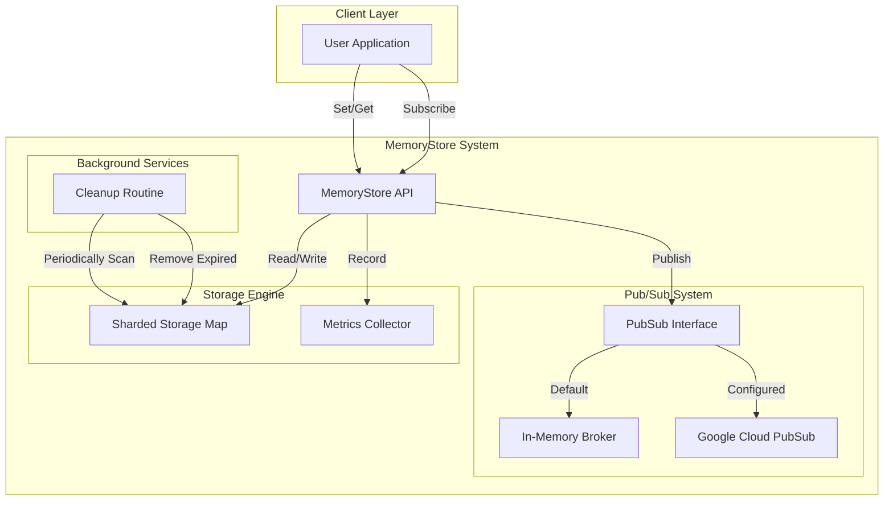
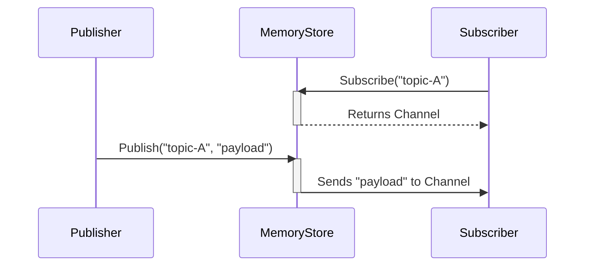

# 🚀 MemoryStore

MemoryStore is a high-performance, thread-safe, in-memory key-value store implemented in Go. It features automatic key expiration, JSON serialization support, batch operations, metrics, and an agnostic Publish/Subscribe system (supporting In-Memory and Google Cloud PubSub).

[](https://goreportcard.com/report/github.com/BryceWayne/MemoryStore)
[](https://godoc.org/github.com/BryceWayne/MemoryStore)

## Features

- 🔄 Thread-safe operations
- ⏰ Automatic key expiration
- 🧹 Background cleanup of expired keys
- 📦 Support for both raw bytes and JSON data
- 💪 High-performance using go-json
- 🚀 Batch operations (`SetMulti`, `GetMulti`)
- 📊 Built-in Metrics and Monitoring
- 📡 Agnostic Publish/Subscribe system (In-Memory & GCP PubSub)
- 🔒 Clean shutdown mechanism
- 📝 Comprehensive documentation

## Installation

```bash
go get github.com/BryceWayne/MemoryStore
```

## Quick Start

Here's a simple example demonstrating basic usage:

```go
package main

import (
    "log"
    "time"
    "github.com/BryceWayne/MemoryStore/memorystore"
)

func main() {
    // Create a new store instance (defaults to In-Memory PubSub)
    store := memorystore.NewMemoryStore()
    defer store.Stop()

    // Store a string (converted to bytes)
    err := store.Set("greeting", []byte("Hello, World!"), 1*time.Minute)
    if err != nil {
        log.Fatal(err)
    }

    // Retrieve the value
    if value, exists := store.Get("greeting"); exists {
        log.Printf("Value: %s", string(value))
    }
}
```

## PubSub Usage

MemoryStore supports an agnostic PubSub interface. By default, it uses an in-memory implementation. To use Google Cloud PubSub, simply provide your Project ID configuration.

### Using In-Memory PubSub (Default)

```go
package main

import (
    "log"
    "time"
    "github.com/BryceWayne/MemoryStore/memorystore"
)

func main() {
    store := memorystore.NewMemoryStore()
    defer store.Stop()

    // Subscribe to a topic
    msgs, err := store.Subscribe("user-updates")
    if err != nil {
        log.Fatal(err)
    }

    // Listen in background
    go func() {
        for msg := range msgs {
            log.Printf("Received: %s", string(msg))
        }
    }()

    // Publish to the topic
    err = store.Publish("user-updates", []byte("User 123 logged in"))
    if err != nil {
        log.Fatal(err)
    }

    // Give time for message delivery
    time.Sleep(1 * time.Second)
}
```

### Using Google Cloud PubSub

```go
package main

import (
    "log"
    "time"
    "github.com/BryceWayne/MemoryStore/memorystore"
)

func main() {
    // Configure with GCP Project ID
    config := memorystore.Config{
        GCPProjectID: "my-gcp-project-id",
    }
    store := memorystore.NewMemoryStoreWithConfig(config)
    defer store.Stop()

    // Subscribe to a topic
    // Note: GCP PubSub creates a subscription for this topic
    msgs, err := store.Subscribe("user-updates")
    if err != nil {
        log.Fatal(err)
    }

    // Listen in background
    go func() {
        for msg := range msgs {
            log.Printf("Received: %s", string(msg))
        }
    }()

    // Publish to the topic
    err = store.Publish("user-updates", []byte("User 123 logged in"))
    if err != nil {
        log.Fatal(err)
    }

    // Give time for message delivery
    time.Sleep(1 * time.Second)
}
```

Or simply set `GOOGLE_CLOUD_PROJECT` environment variable:

```bash
export GOOGLE_CLOUD_PROJECT=my-project-id
```
```go
store := memorystore.NewMemoryStore() // Automatically picks up GCP PubSub
```

## Advanced Usage

### Working with JSON

MemoryStore provides convenient methods for JSON serialization:

```go
type User struct {
    Name  string `json:"name"`
    Email string `json:"email"`
}

func main() {
    store := memorystore.NewMemoryStore()
    defer store.Stop()

    // Store JSON data
    user := User{Name: "Alice", Email: "alice@example.com"}
    err := store.SetJSON("user:123", user, 1*time.Hour)
    if err != nil {
        log.Fatal(err)
    }

    // Retrieve JSON data
    var retrievedUser User
    exists, err := store.GetJSON("user:123", &retrievedUser)
    if err != nil {
        log.Fatal(err)
    }
    if exists {
        log.Printf("User: %+v", retrievedUser)
    }
}
```

### Batch Operations

Efficiently set or get multiple items at once:

```go
items := map[string][]byte{
    "key1": []byte("val1"),
    "key2": []byte("val2"),
}
store.SetMulti(items, time.Minute)

results := store.GetMulti([]string{"key1", "key2"})
```

### Metrics

Monitor cache performance:

```go
metrics := store.GetMetrics()
log.Printf("Hits: %d, Misses: %d, Items: %d", metrics.Hits, metrics.Misses, metrics.Items)
```

### Expiration and Cleanup

Keys automatically expire after their specified duration:

```go
// Set a value that expires in 5 seconds
store.Set("temp", []byte("temporary value"), 5*time.Second)

// The background cleanup routine will automatically remove expired items
// You can also manually check if an item exists
time.Sleep(6 * time.Second)
if _, exists := store.Get("temp"); !exists {
    log.Println("Key has expired")
}
```

### Proper Shutdown

Always ensure proper cleanup by calling `Stop()`:

```go
store := memorystore.NewMemoryStore()
defer func() {
    if err := store.Stop(); err != nil {
        log.Printf("Error stopping store: %v", err)
    }
}()
```

## Architecture

Here's an overview of how MemoryStore is architected:



### PubSub Data Flow



## Performance Considerations

- Uses `github.com/goccy/go-json` for faster JSON operations
- Minimizes lock contention with RWMutex
- Efficient background cleanup of expired items
- Memory-efficient storage using byte slices

## Building and Testing

Use the provided Makefile:

```bash
# Build the project
make build

# Run tests (with race detection)
make test

# Run benchmarks
make bench

# Run linter
make lint

# Format code
make fmt

# Show all targets
make help
```

## Contributing

Contributions are welcome! Please feel free to submit a Pull Request. For major changes, please open an issue first to discuss what you would like to change.

1. Fork the repository
2. Create your feature branch (`git checkout -b feature/AmazingFeature`)
3. Commit your changes (`git commit -m 'Add some AmazingFeature'`)
4. Push to the branch (`git push origin feature/AmazingFeature`)
5. Open a Pull Request

## License

This project is licensed under the MIT License - see the [LICENSE](LICENSE) file for details.

## Acknowledgments

- Thanks to the Go team for the amazing standard library
- [go-json](https://github.com/goccy/go-json) for high-performance JSON operations

## Support

If you have any questions or need help integrating MemoryStore, please:

1. Check the [documentation](https://godoc.org/github.com/BryceWayne/MemoryStore)
2. Open an issue with a detailed description
3. Reach out through the discussions tab
